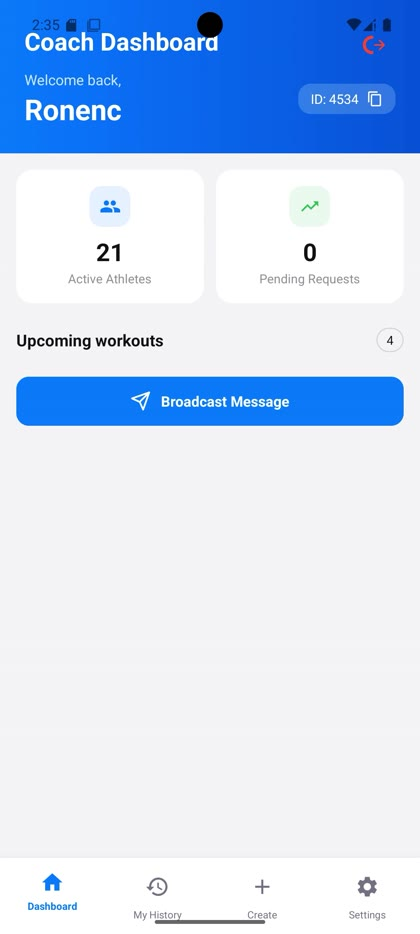
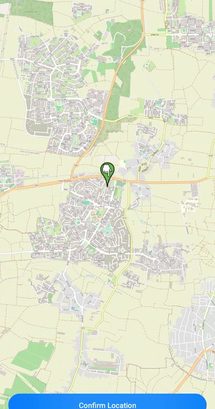
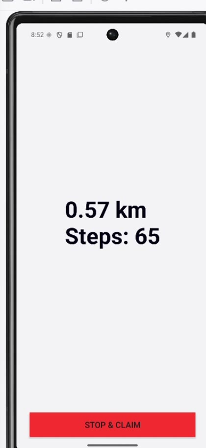
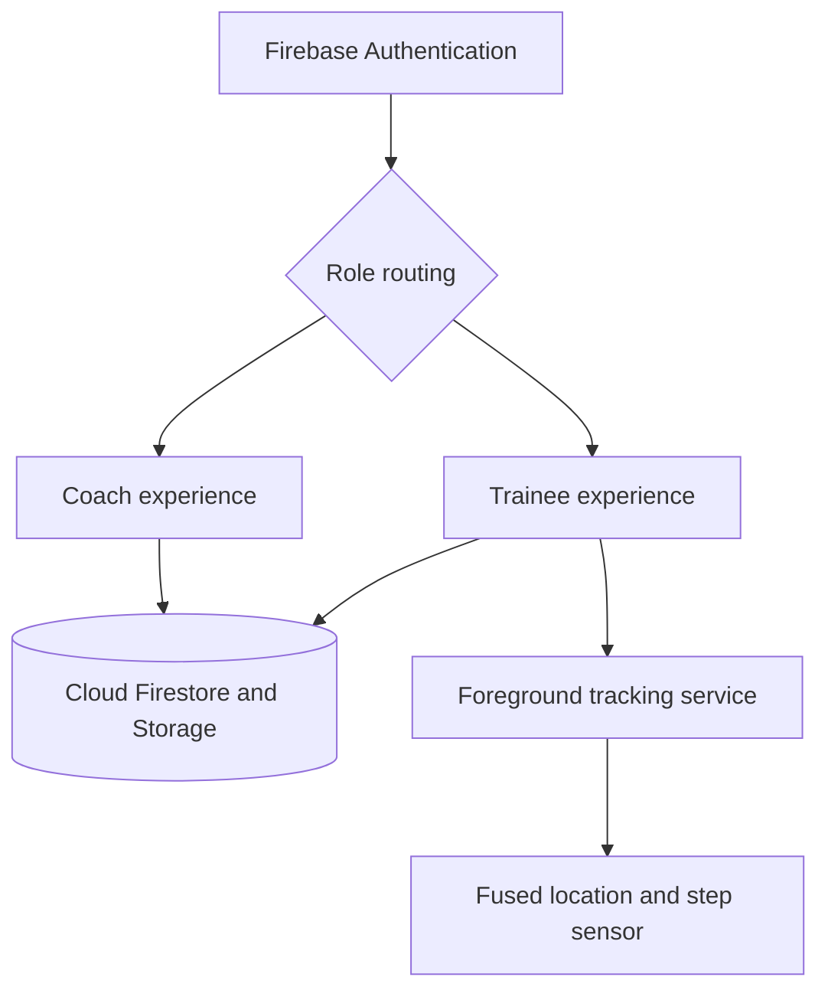

<div align="center">

# Step Buy Step

### A role-based Android fitness platform for coaches and trainees

Track real-world activity, coordinate workouts, manage teams, and turn movement into in-app rewards.


</div>

## Overview

**Step Buy Step** is an Android fitness application that connects coaches with their trainees in one shared platform. Coaches can manage athletes, schedule location-based workouts, organize subgroups, and communicate with their team. Trainees can record walks and runs, review their history, earn coins, upgrade virtual equipment, and compete on team leaderboards.

The project combines role-based workflows, real-time cloud data, background location tracking, step sensing, map-based scheduling, authentication, and gamification in a single Android application.

## App preview

The screenshots below were captured from end-to-end app demos and highlight three core flows.

| Coach dashboard | Map-based scheduling | Live activity tracking |
| :---: | :---: | :---: |
|  |  |  |
| Monitor athletes, requests, upcoming workouts, and team communication. | Search for or select a workout location with OpenStreetMap. | Track distance and steps through a foreground Android service, then claim earned coins. |

## Key features

### Coach experience

- **Team onboarding:** approve or reject trainee join requests associated with a unique coach ID.
- **Workout scheduling:** create a workout with a type, date, time, map location, and selected participants.
- **Team communication:** send broadcast messages to all approved trainees or a selected group.
- **Live dashboard:** view active-athlete counts, pending requests, and upcoming workouts.
- **Roster management:** remove athletes and organize approved trainees into subgroups.
- **Flexible leaderboards:** view general or subgroup rankings and award attendance coins.
- **Subscription tiers:** enforce athlete limits for Basic, Pro, and Elite coach plans, including safe downgrade validation.

### Trainee experience

- **Guided onboarding:** join a coach's team and move through pending, approved, rejected, or re-entry states.
- **Walk and run tracking:** display live distance and step counts while tracking continues in a foreground service.
- **Workout history:** store completed sessions and show accumulated workout and distance statistics.
- **Move-to-earn rewards:** calculate coins from activity type, distance, and the trainee's current shoe multiplier.
- **Shoe progression:** spend coins on sequential equipment upgrades that improve future earning rates.
- **Scheduled workouts:** receive coach-created workouts through a real-time Firestore listener.
- **Messages and badges:** view coach messages, unread counts, and automatic workout notifications.
- **Profile media:** choose a profile picture from the camera or photo library and upload it to Firebase Storage.

### Shared platform capabilities

- Email/password authentication and modern Google Sign-In through Android Credential Manager.
- Role-aware navigation that routes coaches and trainees to separate workflows.
- Firestore snapshot listeners for real-time dashboard, workout, message, and balance updates.
- Firestore transactions and atomic increments for reward and purchase consistency.
- Firebase Cloud Messaging token registration for notification infrastructure.

## Architecture



The application uses an activity-based Android architecture with shared models and RecyclerView adapters. Cloud-backed screens communicate directly with Firebase, while workout tracking is isolated in a bound foreground service so a session can continue reliably outside the activity lifecycle.

Two important data flows are:

1. **Coach to trainee:** a coach publishes a workout → Firestore stores the workout → assigned trainees receive it through a live listener and an in-app message.
2. **Activity to reward:** the tracking service measures distance and steps → the completed session is saved to history → coins are calculated using the activity rate and shoe multiplier → the balance is updated atomically.

## Tech stack

| Area | Technologies |
| --- | --- |
| Android | Android SDK, Java 11, Kotlin, Material Components, XML layouts, View Binding, RecyclerView |
| Backend services | Firebase Authentication, Cloud Firestore, Firebase Storage, Firebase Cloud Messaging |
| Authentication | Email/password, Android Credential Manager, Google Identity Services |
| Tracking | Fused Location Provider, Android step counter sensor, foreground service |
| Maps | OSMDroid, OpenStreetMap, Android Geocoder |
| Image loading | Glide |
| Testing | JUnit 4, Mockito, AndroidX Test, Espresso |
| Build | Gradle 9.3.1, Android Gradle Plugin 9.1.1 |

## Project structure

```text
app/src/main/
├── java/com/example/stepbuystep/
│   ├── ActivityCoach/       # Coach dashboard, scheduling, requests, settings, and team tools
│   ├── ActivityTrainee/     # Trainee dashboard, tracking, history, store, and onboarding
│   ├── ActivityCommon/      # Authentication, leaderboard, notifications, and shared screens
│   ├── adapter/             # RecyclerView adapters
│   ├── model/               # Domain models and subscription/equipment helpers
│   └── service/             # Foreground distance and step tracking service
└── res/
    ├── layout/              # XML screen and component layouts
    ├── drawable/            # Icons, backgrounds, and reusable visual resources
    └── values/              # Strings, colors, dimensions, and themes
```

## Getting started

### Prerequisites

- Android Studio with Android SDK 36 installed
- An Android device or emulator running API 24 or later
- A Firebase project configured for an Android app with package name `com.example.stepbuystep`

### Setup

1. Clone the repository:

   ```bash
   git clone https://github.com/ronench20/Step_Buy_Step.git
   cd Step_Buy_Step
   ```

2. Open the project in Android Studio and allow Gradle to sync.

3. Configure Firebase:

   - Add or replace `app/google-services.json` with the configuration from your Firebase project.
   - Enable **Email/Password** and **Google** providers in Firebase Authentication.
   - Create a Cloud Firestore database and a Firebase Storage bucket.
   - Add the app's SHA-1 and SHA-256 fingerprints to Firebase for Google Sign-In.
   - Create any Firestore composite indexes requested by the Firebase console during first use.

4. Run the app on an emulator or physical Android device.

5. Grant location, physical-activity, notification, and camera permissions when prompted. A device with location services is required for a real tracking session.

## Tests

Run local unit tests:

```bash
./gradlew test
```

Run instrumented UI tests on a connected device or emulator:

```bash
./gradlew connectedAndroidTest
```

The current test suite covers reward-purchase rules, model consistency, mocked messaging behavior, and the coach broadcast-message UI flow.

## Engineering highlights

- A lifecycle-aware, bound foreground service prevents an active workout from being tied to a single screen instance.
- Firestore transactions protect coin spending and shoe purchases from partial updates.
- Approval-state checks are enforced before scheduling, broadcasting, and subgroup membership.
- Subscription downgrades re-fetch the authoritative athlete count before changing plans.
- Snapshot listeners keep coach and trainee dashboards synchronized without manual refreshes.
- Equipment progression creates a feedback loop: activity earns coins, coins unlock shoes, and shoes increase future rewards.

## Project status

This repository contains a functional academic software-engineering project. Potential next steps include server-side push delivery with Cloud Functions, broader automated test coverage, CI-based build verification, and a dedicated data/repository layer as the application grows.
